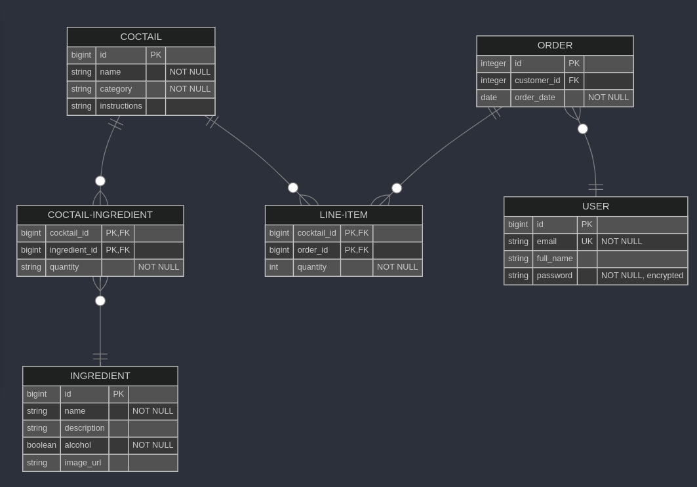

# Docker
To run the app in docker-compose you need to execute
```
$ cp .env.example .env

$ node ace generate:key

$ docker compose build cocktail_api

$ docker compose up -d
```
Once the services are up you can run DB migrations and create admin user by executing:
```
$ docker exec cocktail_api node ace migration:run

$ docker exec cocktail_api node ace create:admin-user
```

You can access the app at `localhost:8080`

# Documentation

See `doc/openapi.yaml`

## DB Schema


# Testing

For testing purposes we need to have postgres instance to use and `.env` file set up properly.

As for the DB I recommend using docker container for that:
```
# first time
$ docker run -p 8082:5432 --name cocktail_api_test -e POSTGRES_PASSWORD=postgres -e POSTGRES_DB=cocktail_api_test -d postgres

# to restart if the container was stopped
$ docker start cocktail_api_test
```

We need to adjust the `.env` file for testing:
```
$ cp .env_test.example .env

$ node ace generate:key
```

Now we can run the tests
```
$ node ace test
```
